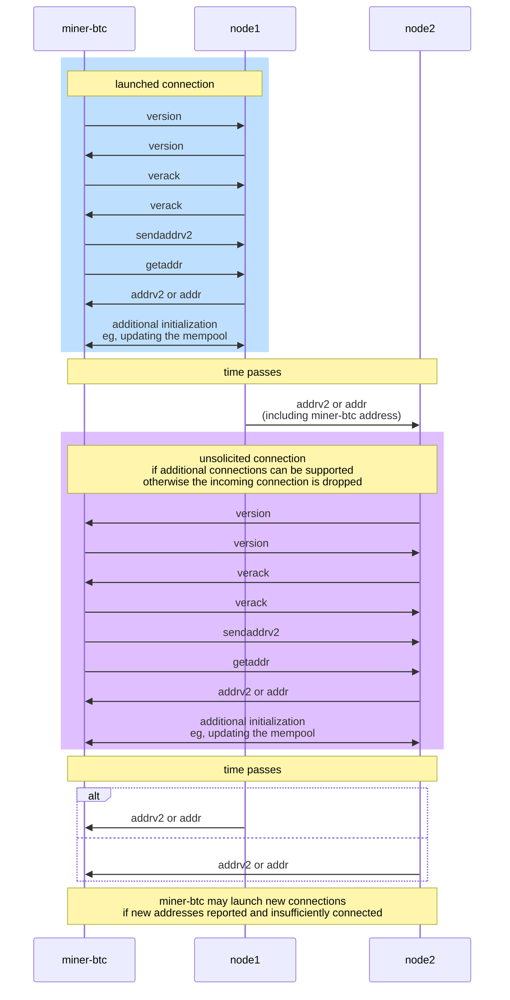

# miner-btc

Experiments in Bitcoin mining

## Peer discovery

- DNS seeds and fallback addresses are hardcoded into [Bitcoin Core](https://github.com/bitcoin/bitcoin)
  - For mainnet (testnet) refer to `CMainParams` (`CTestNetParams`) of [src/chainparams.cpp](https://github.com/bitcoin/bitcoin/block/master/src/chainparams.cpp)
  - Or preferably [contrib/seeds/nodes_main.txt](https://github.com/bitcoin/bitcoin/block/master/contrib/seeds/nodes_main.txt) and [contrib/seeds/nodes_test.txt](https://github.com/bitcoin/bitcoin/block/master/contrib/seeds/nodes_test.txt)
- Validated peers should be stored locally for subsequent startups
- Ref: [Bitcoin > Developer Guides > P2P Network](https://developer.bitcoin.org/devguide/p2p_network.html)

## Peer communication

### Initialization



<!-- FIXME STOPPED
FIXME Not shown but will need to ping and expect pongs periodically
      And of course response appropriately to pings

sequenceDiagram
  participant M as miner-btc
  participant N1 as node1

  loop
    alt node broadcasts a transaction it originates
      N1->>M:tx
    else node relays a transaction
      N1->>M:inv
      M->>N1:getdata
      N1->>M:tx
    end

    alt miner broadcasts newly-mined block
      M->>N1:block
    else node broadcasts newly-mined block
      N1->>M:block
    else node relays newly-mined block
      N1->>M:inv (or headers)
      M->>N1:getdata
      N1->>M:block
    end
  end
-->

References:
- [Bitcoin > Developer Guides > P2P Network](https://developer.bitcoin.org/devguide/p2p_network.html)
- [Bitcoin > Reference > P2P Network](https://developer.bitcoin.org/reference/p2p_networking.html)

## Proxy use

- Install tsocks (eg `apt-get install tsocks`)
  - May need to install from source for proxied DNS lookup support, ref `tsocks(8)`
- Configure tsocks 
  ```
  $ mv /etc/tsocks.conf /etc/tsocks.conf.orig
  $ cat <<EOF >/etc/tsocks.conf
  server = 127.0.0.1
  server_type = 5
  server_port = 1080
  EOF
  ```
- Launch the SOCKS5 proxy (eg `ssh -nNT -D 127.0.0.1:1080 <host>`)
- `tsocks cargo run [--bin <binary>] [-- <arguments>]`